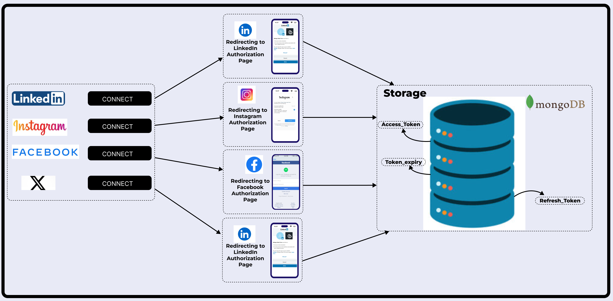
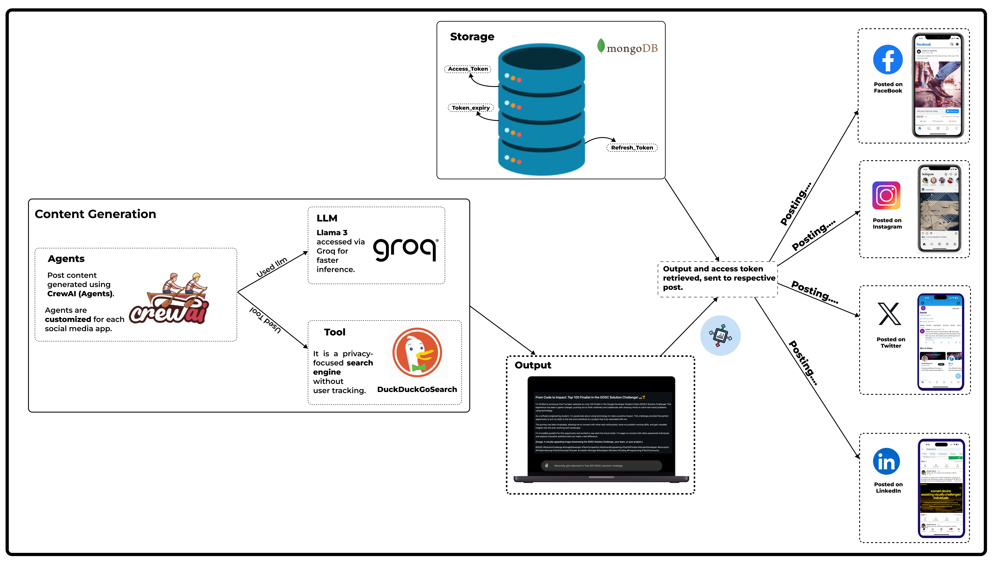
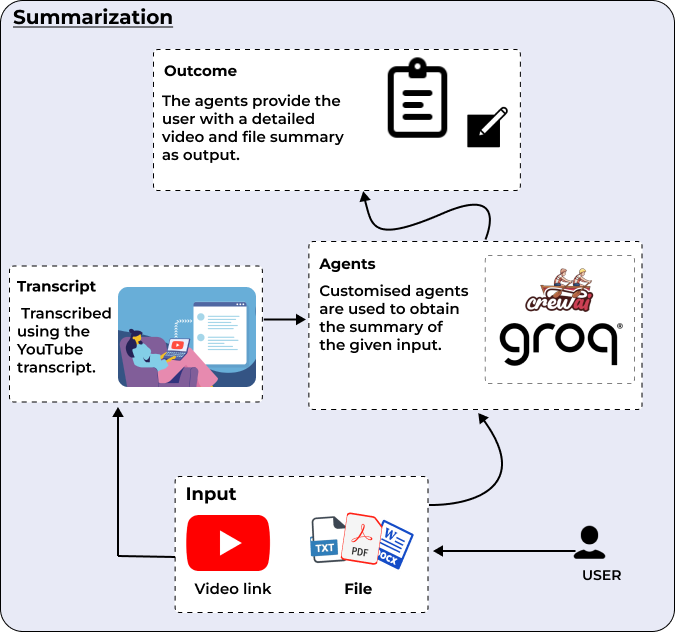
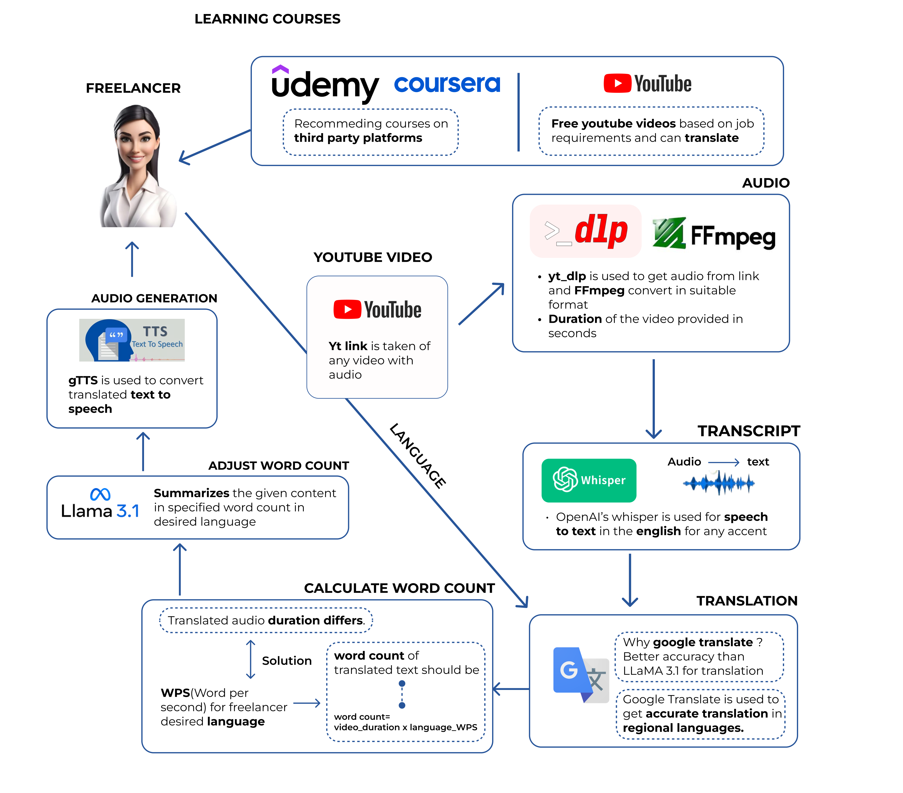
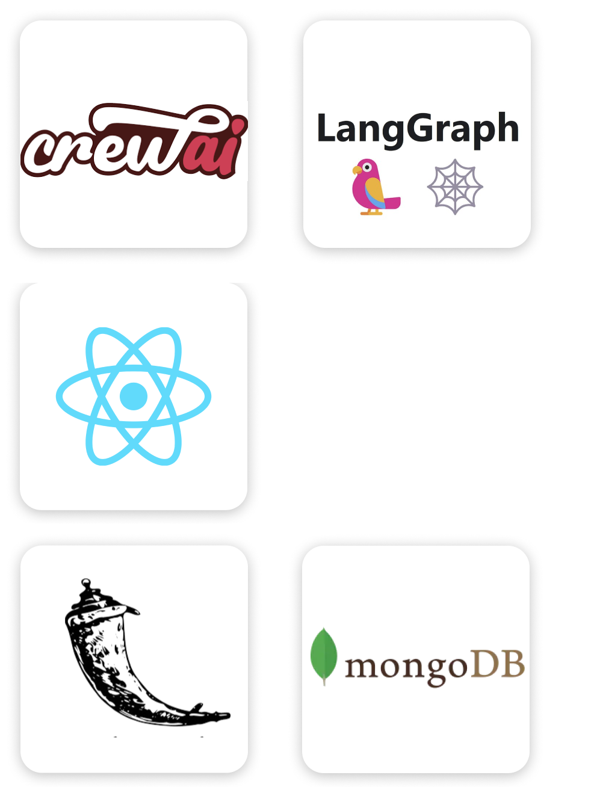

# EduSage - AI-Powered Learning Platform

EduSage is a comprehensive, AI-driven educational platform designed to enhance independent learning for students. The platform leverages cutting-edge technologies like Whisper for transcription, Gemini for AI-powered question generation, Mediapipe for real-time interactive sessions, and more. EduSage empowers students to translate and interact with educational content, receive tailored feedback, and engage in virtual classrooms, all while ensuring a seamless, scalable, and secure experience.

## Process

1. **Authorization:**


    
    - Users are redirected to LinkedIn, Instagram, Facebook, and Twitter for authorization after initiating connections.
    - Upon successful authentication, access tokens, refresh tokens, and token expiry information are obtained.
    - All tokens and expiry details are securely stored in MongoDB.

2. **Content Generation:**


     
    - Agents use CrewAI technology, supported by Llama 3 and DuckDuckGo, to generate posts.
    - Tokens are securely stored in MongoDB for authentication.
    - Posts are automated across Facebook, Instagram, Twitter, and LinkedIn.

3. **Summarization:**

    
    - VerbiQube automatically generates announcements and posts for Discord servers.
    - When a YouTube video is uploaded and linked to Discord, it triggers the post creation.
    - The video is converted into a post specifically tailored for the Discord community.

4. **Posting:**

    
    - Access tokens are used to authenticate and post content to various platforms.
    - The generated content is automatically shared using these tokens.
    - Tokens ensure secure posting to platforms like Facebook, Instagram, Twitter, and LinkedIn.

4. **Youtube translation and Q&A:**

    
    - YouTube audio is processed using youtube-dlp and Whisper to generate transcripts for Q&A.
    - Transcripts are transformed into embeddings and stored in a FAISS vector database for efficient retrieval.
    - FAISS retrieves relevant transcript sections for questions, and a language model (Gemini) generates accurate answers.

### Technologies Used



1. **Whisper** - For speech-to-text transcription of videos.
2. **Gemini** - AI-powered question generation and content tailoring.
3. **Mediapipe** - Real-time video analytics and interactive features during virtual lessons.
5. **Flask** - Backend web framework.
7. **MongoDB** - Database for storing user data and reports.
10. **React** - Front End.
11. **Google Translate** - For Multilingual Support.
12. **Open CV** - For Image processing.

### Installation

1. **Clone the Repository:**
   ```bash
   git clone https://github.com/Daniel-Das-k/EduSage.git
   cd EduSage/backend/
   ```

2. **Create a Virtual Environment:**
   ```bash
   python3 -m venv edusage
   source edusage/bin/activate   # On Windows: `env\Scripts\activate`
   ```

3. **Install Dependencies:**
   ```bash
   pip install -r requirements.txt
   ```

4. **Set Up Environment Variables:**
   Create a `.env` file in the root directory with the necessary API keys and configuration settings.

5. **front-end Application:**
   ```bash
   cd client
   npm i 
   npm run dev
   ```

6. **Back-end Application:**
    ```bash
   cd backend
   python app.py
   ```

7. **Access the Application:**
   Open your browser and navigate to `http://127.0.0.1:5000/`.

### Usage

- **Upload Documents:** Students can upload documents to receive AI-generated questions and feedback.
- **Transcribe and Translate Videos:** Students can input YouTube video links, and the platform will transcribe, translate, and sync audio playback.
- **Join Virtual Classes:** Teachers and students can connect via virtual meetings for interactive learning sessions.

### Future Opportunities

1. **Expanded Language Support** for transcription and translation.
2. **AI-Powered Personalization** for tailored learning experiences.
3. **Mobile App Development** for on-the-go learning.
4. **LMS Integration** to streamline educational workflows.
5. **Gamification Features** to boost student engagement.